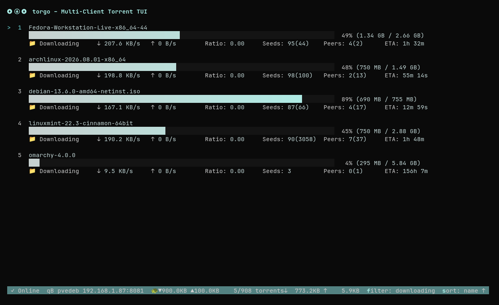

# torgo – Multi-Client Torrent TUI

A terminal user interface for managing torrents across **qBittorrent** and **Transmission** instances — simultaneously from one terminal.

Torgo is not designed to be a comprehensive or feature-complete replacment for your torrent client's native webUI, but rather
a lightweight TUI that can be used for torrent monitoring and most regular management tasks.



Resources used: 908 torrents active, ~26 MB RAM


**Features:**
- Connect to unlimited qBittorrent + Transmission instances, switch with one key
- Two views: compact single-line or detailed multi-line with gradient progress bars
- Full torrent ops: pause/resume, add (magnet/URL/file), delete (with/without data)
- Recheck, reannounce, queue priority (up/down/top/bottom)
- Search (title + `tr:<tracker>` qualifier), filter (8 statuses), sort (8 fields, asc/desc)
- Detail view with tabs: info, edit (name/tags/location), category, file selection
- 4 built-in themes (dark, light, high-contrast, terminal) + omarchy + custom, hot-reload on disk change
- Speed limit toggle, copy magnet to clipboard, multi-select for bulk ops
- Category/label emoji icons (50+ mappings, substring-matched)
- Private tracker indicator (🔒): distinguish private from public torrents at a glance

**Screenshots:** [SCREENSHOTS.md](SCREENSHOTS.md)

Numerous screenshots available including oneline vs multiline view, detail views, full hints bar, multi-select,
search, modals, themes, and state-dependent progressbars. 

## Quick Install

```bash
go install github.com/pdfrg/torgo@latest          # or:
git clone https://github.com/pdfrg/torgo && cd torgo && make build
```

## Quickstart

```bash
cp config.example.toml ~/.config/torgo/config.toml
# edit ~/.config/torgo/config.toml with your client credentials
# (passwords support $ENV_VAR expansion)
torgo
```

Press `?` for help, `q` to quit.

**Full documentation:** [DOCUMENTATION.md](DOCUMENTATION.md)

## License

MIT — see [LICENSE](LICENSE).
